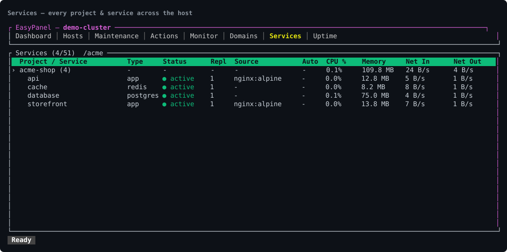
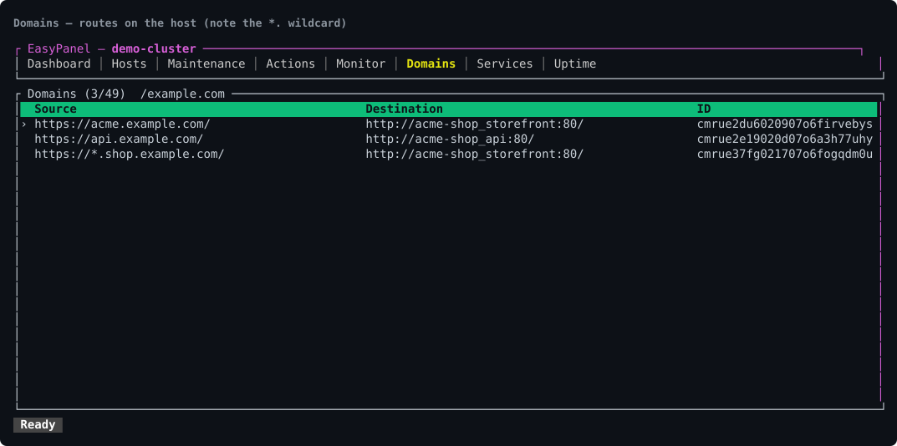
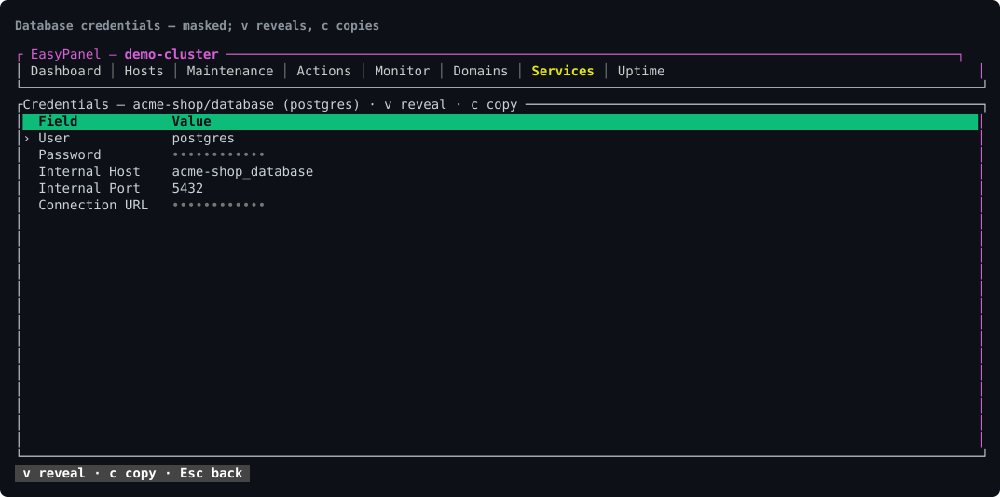

<div align="center">


[](https://github.com/mrfansi/easypanel-cli/actions/workflows/ci.yml)
[](https://github.com/mrfansi/easypanel-cli/releases/latest)
[](LICENSE)

**Manage many [EasyPanel](https://easypanel.io) hosts from one terminal** — a Rust CLI and a full-screen TUI.

</div>

EasyPanel's web panel shows you one server at a time. This shows you all of them: every
host's CPU, memory and disk side by side, every service across every project in one
searchable table, and every domain on the box — without clicking through a hierarchy.

## 📸 Screenshots

**Every service across every project, with live metrics, in one searchable table:**



**Every route on the host — a wildcard shows its `*.` prefix, dead routing is marked `✗`:**



**A database's credentials — masked until you press `v`; `c` copies the value to your clipboard:**



<sub>The screenshots are the real TUI, rendered to SVG with [`docs/ansi2svg.py`](docs/ansi2svg.py) from a throwaway demo project; the server label is renamed. Regenerate with `tmux capture-pane -e -p | python3 docs/ansi2svg.py "Title" > out.svg`.</sub>

**Things it does that the web panel can't, or can't from one screen:**

- **Clone a service** (`c`) — copy a service's whole config (image/source, build, env,
  resources, mounts, ports, and a database's advanced config file) into a new service, in
  any project. Config only, no data, no deploy. EasyPanel's own panel has no clone. The
  motivating case: standing up a **MySQL replica** without re-entering everything by hand.
- **Migrate a service — or a whole project — to another EasyPanel host.** Pick the
  destination server, name the target project (it's created there if missing), and the
  config goes over: image/source, build, env, mounts, ports, resources, a database's
  advanced config file and credentials, and the domains. Moving between hosts is
  painful in the web panel, which has no export and no import — you retype everything.
  (`easypanel project export <name>` writes that same config to a git-committable JSON
  file, secrets redacted — see the CLI section.)
  **Config only, never data:** volume contents and database rows live on the origin
  host's disk and the API does not expose them, so plan to move those yourself
  (`mysqldump`, a volume copy). Domains come over pointing at their existing hostnames —
  aim the DNS at the new host when you're ready to cut over.
- **Search one keyword across every service's logs at once** (`g`) — a parallel fan-out
  over all services, grouped by where it hit. "Which service logged this error?" in one
  keystroke.
- **A real shell inside any container** (`t`), embedded right in the pane — colours,
  arrows, tab-completion, resize, all of it, over EasyPanel's own WebSocket.
- **One-key database shell** (`y`) — `mysql`, `psql`, `mongosh` or `redis-cli` already
  logged in with that service's own stored credentials. You never type a password, and
  it never appears in `ps`. Nothing like it in the panel.
- **Database credentials, read and copy** (Shell menu → Credentials) — user, password,
  internal host/port and a ready-to-paste connection URL for any database service.
  Masked by default; `v` reveals, `c` copies the selected value to your clipboard (via
  OSC 52, so it works over SSH and tmux too).
- **Crash visibility** — a service whose Swarm replicas are missing shows a pulsing red
  `down`, counted in the title, so "what's broken right now?" is answered at a glance.
- **Deploy visibility** — a service that is building shows `deploying` (and a count in
  the title), so you can see a deploy is still running instead of re-triggering it
  blindly. Immediate rejections surface instead of being swallowed.
- **Compare two services, or a whole project, across hosts.** Mark two services (`v` on
  each) → "Compare the 2 marked services"; or on any service pick "Compare with another
  host" for the same service on another server; or on a project pick "Compare WHOLE
  project with another host" to see, in one screen, which services exist on only one side
  and which have drifted — the real "is staging in sync with production?" question. One screen: source, build, deploy,
  resources, and env compared **by key** (which vars differ or are missing, never the
  values — an env is full of secrets). The panel makes you open two tabs and read them
  side by side, and cannot compare across hosts at all.
- **Dead routing, found for you** — a domain whose destination service has been renamed
  or destroyed still looks perfectly healthy in the panel. Here it is marked `✗` and
  counted in the title. On a real host with 713 domains, exactly one was dead; nobody
  finds that by reading.
- **Bulk-edit every domain at once** (`E` on Domains) — find-and-replace one part of many
  domains in a single pass: the host, the destination service, or a custom destination's
  URLs. Filter to the set you mean, see the whole before → after list, then apply. Moving
  a fleet to a new hostname in the panel means opening each domain's dialog in turn.
- **Uptime checks for the domains YOU pick** (`w` on a domain, then the **Uptime**
  tab) — the panel can only tell you what it *intended* to serve; this asks the domain
  itself. Any HTTP method with a body and headers, the status you expect, and a latency
  split into the server thinking (TTFB) and the whole response. Only what you enrol is
  watched, never all of them.
- **Global search / command palette** (`:`) — jump to any service or tab by typing, and
  run any action on the selected row from the same box (`deploy karir`, `logs api`). It
  knows every service from the moment the app starts, so it works before you have opened
  anything.
- **Cloudflare beside EasyPanel** (`W`) — switch into account analytics, domains, R2 and Workers
  without leaving the terminal. The Cloudflare workspace has clickable product tabs, an
  account picker you can edit in place, row actions in the `:` palette, visible status
  feedback, and the same mark-then-`Space` bulk flow used by EasyPanel tables.
- **Mouse and keyboard** — click tabs and rows, right-click for a context menu, scroll,
  hover to highlight; every action also has a key.

## Install

Download a binary from [Releases](https://github.com/mrfansi/easypanel-cli/releases)
(linux-x86_64, darwin-arm64, darwin-x86_64), or build it:

```bash
cargo build --release          # target/release/easypanel
./install.sh                   # or: PREFIX=~/.local/bin ./install.sh
```

### Shell completions

```bash
easypanel completions zsh  > ~/.zfunc/_easypanel        # zsh (ensure ~/.zfunc is in $fpath)
easypanel completions bash > /etc/bash_completion.d/easypanel
easypanel completions fish > ~/.config/fish/completions/easypanel.fish
```

`elvish` and `powershell` also work. With no argument the shell is guessed from
`$SHELL`. `install.sh` installs zsh/bash/fish completions automatically when it can
find the right directory.

### Man page

```bash
easypanel man > ~/.local/share/man/man1/easypanel.1
man easypanel
```

Release tarballs ship `easypanel.1` alongside the binary, and `install.sh` installs it
when it finds a writable `man1` directory.

## Configure

Credentials live in `~/.config/easypanel/servers.json`, mode `0600`.

```bash
easypanel server add prod --url https://panel.example.com --token <TOKEN>
easypanel server add prod            # interactive
easypanel server list
easypanel server use prod            # make default
easypanel server remove prod
```

Get a token from EasyPanel → Settings → API Tokens. The first server becomes the
default; every command accepts `--server <name>`.

On the CLI there is no `server edit` — **editing means `add` with the same name**, which
overwrites the entry and keeps its default flag (handy for token rotation).

From the TUI, press `s`: `n` add, `e` edit, `x` delete. The edit form pre-fills the
**name** and URL; a **blank token means unchanged**. Changing the name **renames** the
server in place, keeping its token, its default flag and its position in the list —
renaming onto a name that already exists is refused rather than merging two hosts into
one entry. That matters because a token cannot be read back from anywhere: before, the
only way to fix a typo in a name was to delete the server and lose its token with it.

**Switching host in the TUI is remembered.** `Enter` on a server in that list makes it
the default, so the next launch comes up on the host you were last working on rather
than silently going back to the old one.

## TUI

Run with no arguments:

```bash
easypanel                 # default server
easypanel --server prod   # a specific host
```

Press **`?`** at any time for every shortcut on the current screen.

You don't have to memorise keys. Related actions live in **grouped menus** — one key opens
a list you arrow through (`e` Env, `o` Networking, `u` Build & source, `m` Storage, `d`
Lifecycle, `t` Shell, `x` Danger) — and **`Space`** opens the full action menu for the
selected row. **`:`** opens a **global search**: type to jump to any service or tab, or to
run an action on the row you're on.

The TUI is also **mouse-driven**: click a tab to switch, click any table row to select it,
**right-click a row for a context menu** of its actions, and scroll to move through tables
or the viewer. (Mouse capture disables the terminal's own text selection — hold **Shift
while dragging** to select/copy.)

| Screen | What it is |
|---|---|
| **Dashboard** | CPU/memory/disk gauges, CPU history, load average, cluster nodes — active server only. |
| **Hosts** | **Every** configured server at once. Each host is fetched on its own thread, so a slow or dead one never blocks the rest; failures show red with the reason instead of failing the table. **`Enter` opens a host's detail** — the full reason an unreachable one is unreachable (the table cell only has room for the first few words), or the complete figures for a healthy one. Columns drop as the terminal narrows rather than shrinking into half-numbers. The one screen the web panel can't replace. |
| **Maintenance** | Docker version, server IP, update availability, plus system prune / image cleanup / builder cleanup — all behind confirmation. |
| **Actions** | Deploy/destroy/login history with status, target, duration, age. The status is coloured: green `done`, yellow `killed` (stopped on purpose), red `error` (failed on its own). `f` shows only the actions that did NOT finish cleanly, so a handful of failures is one keypress out of hundreds of successes. |
| **Monitor** | Five history tiles (CPU, memory, disk, net in/out) plus per-service metrics and storage (`v` switches). |
| **Domains** | Every domain on the host: source → destination (internal service or weighted custom servers), SSL resolver, wildcard. A **wildcard** shows a `*.` in front of its host (`https://*.edu.example/`), so it never reads as a duplicate of the apex domain. A domain pointing at a service that **no longer exists** is marked `✗` in red and counted in the title — dead routing is invisible among hundreds of live rows. `w` enrols one for uptime checks. |
| **Uptime** | The domains you enrolled, and what they last answered — broken ones first, then the slowest. Shows the status code, TTFB, total, and how a domain compares with its peers. `r` checks them all, `e` edits the request, `x` stops watching. |
| **Services** | **Every project and service in one searchable table** — a project header (with its service count and aggregate metrics) followed by its services, so the hierarchy stays visible without drill-down. A colored status dot reads at a glance: green `active`, yellow `stopped`, gray `disabled`, cyan `deploying` (a build is running), and a pulsing red **`down`** for a crashed/restart-looping service (its Swarm replicas are missing), counted in the title. From a selected service you can do the lot, grouped into menus — logs, terminal & DB shell, deploy/restart/stop/start, clone, env (view/edit/replace/`.env` file), ports, mounts, redirects, domains, resource limits, basic auth, and a database's config file. Selecting a project header targets the project and opens its own menu (`Space`): migrate the whole project to another host, new service, new project, destroy project. |
| **Viewer** | Scrollable pane for logs, env, ports, mounts, redirects, backups, source & build, and a two-service diff. Credentials are masked — a field whose name reads like a secret shows as `••••••••` rather than in the clear. Reached from a service; `Esc` goes back. In the ports/mounts/redirects view, a digit key deletes that row. **Logs tail live** — the pane sticks to the newest line and new output appears as it happens; scrolling up pauses the follow (the title says so) and `End` resumes it. Long lines are not wrapped — `←→` scroll sideways, and the pane says so at the bottom-right when a line runs past the edge, then shows which column you are on once you scroll. |

### Key bindings

**Anywhere**

| Key | Action |
|---|---|
| `?` | every shortcut for the current screen |
| `:` | **global search** — jump to any service or tab, or run an action on the selected row |
| `1`–`8`, `Tab`, `←`/`→` | switch tabs (`2` = Hosts, `8` = Uptime) |
| `/` | filter (Services, Domains, Actions, Monitor) · `Esc` clears |
| `s` | server list: `Enter` switch · `n` add · `e` edit (name, URL, token) · `x` delete |
| `r` · `q` | refresh · quit (`Esc` **cancels**, it does not quit) |

**Services — one key opens a menu of related actions**

| Key | Opens |
|---|---|
| `Space` / right-click | the full action menu for the selected row |
| `e` | **Env** — the service's env (`e` there edits it in `$EDITOR`) and the **project env** shared by every service in the project |
| `o` | **Networking** — domains · ports · redirects · basic auth |
| `u` | **Build & source** — source · build · auto deploy · resource limits · a database's **config file** |
| `m` | **Storage** — mounts · backups |
| `d` | **Lifecycle** — deploy · force rebuild (no cache) · restart · stop · start (each confirmed) |
| `t` | **Shell** — container shell · DB shell · credentials (view & copy) |
| `x` | **Danger** — delete service · delete project |

Inside a menu: `↑↓` select · `→` enter a submenu · `←` back · `Enter` run · `Esc` close.

**Act on many services at once.** `v` marks the row under the cursor (a project header
marks all its services); `V` marks every row the filter has left on screen. With anything
marked, the action menu (`Space`) grows a bulk section: **deploy / force-rebuild / restart
/ stop / start** the marked set, **set the same resource limits** (CPU/memory) across all
of them in one form, or **compare** exactly two. Every bulk entry names its count, and the
result reports each service that succeeded or failed — nothing is changed silently.

**Services — direct keys**

| Key | Action |
|---|---|
| `Enter` | logs for the selected service (**live**; `End` re-follows) · on **Actions**, the action's detail + deploy log |
| `y` | **DB shell** — `mysql`/`psql`/`mongosh`/`redis-cli`, already logged in |
| `t` → Credentials | **view & copy** a database's user, password, host, port and connection URL (`v` reveal · `c` copy) |
| `g` | **search a keyword across every service's logs at once** |
| `c` | **clone the service's config into a new service** (any project) |
| `Space` | open the action menu for the selected row (a service, or a project header) |
| `p` · `b` | view ports · backups |
| `n` · `N` | new service · new project |

**Each collection is one screen.** Open the env, the ports, the mounts, the redirects or
the source, and act on it from there: `↑↓` selects a row, `n` adds, `x` deletes the
selected one, `e` edits (and `b` sets the build on the source screen). The screen lists
its own keys along the bottom. There is no separate "Add port" or "Replace env" entry any
more — viewing a thing and changing it are the same place, and `n`/`e`/`x` mean the same
here as they do on Domains and in the server list.

The pre-menu keys still work if you have the muscle memory: `E` `.` (edit env, toggle
`.env` file), `P` `M` `F` (add port, mount, redirect), `f` (view redirects), `U` `B` `A`
`L` `H` (source, build, auto deploy, resource limits, basic auth), `R` `S` `T` (restart,
stop, start), `X` (delete project).

**Viewer** — `↑↓`/`PgUp`/`PgDn` scroll · `←→` scroll sideways (lines are not wrapped) ·
`Home` first line and left edge · `End` re-follow the log tail · `[0]`–`[9]` deletes that
row (ports/mounts/redirects) · `Esc` back.
**Domains** — `n` new · `e` edit · `E` bulk edit · `x` delete · `P` set primary.

`E` rewrites one part — the host, the destination service, or a custom
destination URL — across every domain currently on screen, so `/` narrows the
set first. It is a plain find-and-replace, not a regex, and it shows the full
before → after list for approval before anything is sent.
**Terminal** — `Ctrl-Q` to leave (or type `exit`).

**Dockerfile sources open in `$EDITOR`.** Pick `dockerfile` as the source and the field
shows how many lines it holds; `Space` opens the content in `$VISUAL`/`$EDITOR` (the
same hand-off `E` uses for env), and the form takes back the terminal when you quit.
A Dockerfile is not a single-line value, and `updateSourceDockerfile` takes its contents
inline rather than a path — so pretending otherwise would send one long line that never
builds.

### Project environment

A project can hold variables that **every service in it receives**, and `e` → "Project
env" opens them in your editor. The entry says which project it belongs to and how many
services that is, because it is one level up from the service env sitting above it in the
same menu.

Saving is not the whole story, and the tool says so: **running containers keep the old
values until they are deployed again.** Rather than reporting "saved" and leaving you to
discover that later, it names how many services now run stale values and offers to deploy
them — counting only the types that can be deployed at all, since a database or a
WordPress has no build step.


## Uptime checks

A domain in the panel is a routing rule, not a promise. It can point at a service that
was renamed, a port nothing listens on, or a container that stopped — and the panel will
keep showing the rule as if it were fine. The **Uptime** tab (`8`) asks the domains
themselves.

**You choose what is watched, and what it is checked with.** Put the cursor on a domain
(`6`) and press `w`: a form opens for the method, body, headers, timeout and expected
status, and nothing is stored until you save it. Pressing `w` on a domain you already
watch reopens that same form to edit it; `x` on the Uptime tab stops watching. On a host with 700 domains most are aliases and parked names, and a list
that watches everything is a list nobody reads — so the watchlist is deliberately short
and deliberately yours. It is stored per server in
`~/.config/easypanel/checks.json`, mode `0600` (a check may carry an `Authorization`
header).

`r` checks them all at once, eight at a time. Each row shows:

| Column | What it means |
|---|---|
| ● | green = answering as expected · orange = answered, but not with the status you want · red = no answer at all · grey = not checked yet |
| Code | the status it actually returned |
| TTFB | the wait until the response head arrived — **the server thinking** |
| Total | including the body coming down the wire |
| Note | how it compares with its peers, or why it failed |

**Redirects are not followed and count as working.** The question is whether *this*
domain and path answer; following the hop would report on a different URL and time it
too. An http→https jump, a canonical host and a login wall all answer with a 3xx, and
calling those "down" is the false alarm that teaches people to ignore alarms.

`e` on the Uptime tab opens the same form: **any method with a body and headers** (`Name: value`, one per
line, the shape you already paste from curl), a timeout, and the status you *expect* —
an API that correctly answers `401` to an unauthenticated probe is working, and a `200`
from it would be the alarming answer.

### Reading the latency

A single number is close to meaningless: 500 ms is only slow relative to something. Two
comparisons are built in, and neither needs any stored history.

**The split.** A high TTFB with a fast finish is a slow application. A fast start with a
slow finish is a big payload or a slow link. One combined figure tells you there is a
problem; the split tells you where.

**The peers.** Checking the whole watchlist at once gives a median to judge against, so
the Note column can say "3.2× slower" — the same network, the same machine, the same
moment. The median, not the mean: one timeout would drag a mean past everything that is
genuinely slow.

Checks run **from your machine**, so they measure what a visitor experiences — DNS, CDN
and your own link included.

### Your editor

Env files, Dockerfiles and database config files open in your own editor. The temp file
it hands over is created readable by you alone (`0600`) — on a shared machine `/tmp` is
world-readable, and a service's env is the densest collection of secrets it has. The first
of `$EASYPANEL_EDITOR`, `$VISUAL`, `$EDITOR` that is actually installed wins, falling
back to `vi` then `nano`. `EASYPANEL_EDITOR` exists so you can use a terminal editor
here without changing the editor the rest of your machine uses.

**GUI editors work — including VS Code, Cursor, Zed, Sublime and the JetBrains IDEs.**
They need a flag to block until you close the file, and it's added for you:

```bash
export EDITOR=code          # runs as: code --wait <file>
export EDITOR="code -w"     # already correct, left alone
export EDITOR=nvim          # terminal editors block anyway, untouched
```

Without that flag these editors hand the file to an already-open window and exit
immediately — the TUI would read the file back before you typed anything, see no
change, and discard your edit. While a GUI editor is open the terminal says what it's
waiting for, so the blank screen doesn't look like a hang.

If your `code` is a shell alias rather than a real command (common on macOS), point
`$EDITOR` at the binary itself — in VS Code, run **Shell Command: Install 'code'
command in PATH** from the command palette.

**`n` opens a creation wizard that follows the EasyPanel dashboard's flow:**
**Basics → Source → Build → Environment → Domains.** `Enter` advances a step, `Esc` goes
back, and the title shows where you are (`2/5 Source`). A database is a single step —
it has no source or build to configure. Every field is optional except the name; leave
source empty for a bare app you'll configure later, and the *Create .env file* toggle in
Environment writes the vars as a `.env` file (the dashboard's "Create env file").

Creating the service does **not** deploy it. It appears in the table in about a second,
and you press `d` to deploy when you're ready — the same order the dashboard uses.
(Applying a source inline at creation would trigger a ~100-second build-and-deploy that
can fail before the row even shows; the source is applied as a separate, config-only
call instead.)

Logs are not a snapshot. EasyPanel has no log streaming endpoint — there is exactly one
SSE route on the whole API and it is for the Actions list — so the tail polls
`queryServiceLogs` every two seconds with `start` set past the newest line already
shown, which fetches only what is new rather than re-pulling 200 lines. It runs on the
metrics lane, so it never queues behind a key you pressed.

The Services table has a **Repl** column: how many replicas the service runs. While
Swarm's live count matches the target it is just the number; when they differ it
shows both — `0/1` for replicas that never came up, `1/3` mid-rollout — which is
exactly when the number matters. It falls back to the configured `deploy.replicas`,
and shows `-` for a service with no deploy block.

**The table adapts to the terminal.** Under ~120 columns the four metric columns
(CPU, memory, net in/out) are dropped rather than squeezed into unreadable slivers;
identity, status, replicas, source and auto deploy always survive. The numbers are on
the Monitor tab either way.

The Services table has an **Auto** column: `✓` auto deploy on, `✗` off, `-` not
applicable. Only GitHub sources have auto deploy at all — it works by creating a
webhook — so a database or an image-sourced app shows `-`, never `✗`. `✗` would claim
it was turned off, when in truth it was never available.

Filters match the text you **see**, so `mysql` finds it via service name, project name,
type, or source. The title shows `(matched/total)`, and filters clear when you switch
tabs — a hidden filter makes missing rows look like missing data. Every keystroke puts
the view back on the **first match**, so narrowing a long list always shows you results
rather than leaving you parked wherever you had scrolled to. The arrows work while you
are still typing.

Creating a database service asks for what the panel asks for — database name, user,
password, root password, image — with the fields swapping to match the type you pick.
All optional: **leave one empty and the server generates it** (random password, database
named after the project, official latest image), exactly like the web panel. Empty
fields are omitted from the request rather than sent as `""`, because those are not the
same thing: `""` creates a MySQL with no database, no user and no password.

Choice fields (project, service, repo, branch, type) open a searchable dropdown rather
than free text, so a typo can't point a domain at a service that doesn't exist. Repo and
branch lists come from live GitHub data via the panel.

Network runs on worker threads, so the UI never freezes on a slow request. Metrics poll
on a separate lane and can't block your keystrokes.

## CLI

```bash
easypanel project list|create|inspect|destroy
easypanel project export <name> [--file <path>|-]   # config → git-committable JSON

# Lifecycle
easypanel service create|deploy|restart|start|stop|destroy <project> <service> [--type app]
easypanel service deploy <project> <service> --force   # rebuild, ignoring the layer cache
easypanel service logs <project> <service> [--limit 100]

# Environment (set-env replaces everything; reads --file or stdin)
easypanel service env|set-env <project> <service> [--file .env]

# Ports, mounts, domains
easypanel service ports|mounts|domains <project> <service>
easypanel service port-add    <project> <service> --published 8080 --target 80
easypanel service mount-add   <project> <service> --kind volume --name data --mount-path /data
easypanel domain list|delete|set-primary

# Databases & backups
easypanel service databases|backups|volume-backups <project> <service>
easypanel backup db-run|db-delete|volume-run|volume-delete <id>
easypanel backup providers
easypanel backup db-restore --project P --service S --database D --path <path> [--yes]

# Non-locking dump to object storage, and cross-server restore (mysql/mariadb)
easypanel db dump <project> <service> --databases a,b,c   # or --all
easypanel db list <project> <service>                     # the dumps written so far
easypanel db restore <project> <service> --path <key> [--yes]

# Maintenance (active server)
easypanel maintenance info|prune|cleanup-images|cleanup-builder [--yes]

# Monitoring
easypanel stats                      # CPU/mem/disk/load
easypanel monitor services|storage
easypanel node list
easypanel action list [--limit 25]
easypanel certificate list|remove
easypanel notification list|delete
```

`--type` defaults to `app`; other types (mysql, postgres, redis, mongo, mariadb,
wordpress, compose) match your EasyPanel services.

### Non-locking database dump to object storage

EasyPanel's own database backup has three problems an operator feels: it **locks
the running database** (no `--single-transaction`, so apps error out during the
backup), it files **one backup per database**, and its restore only works **into a
database that already exists** — so carrying a backup to a fresh host fails. `db
dump` / `db restore` are our own path around all three (mysql/mariadb today):

```bash
easypanel db dump vidingco-db mysql --databases studio,billing   # or --all
easypanel db restore other-host-db mysql --path vidingco-db/mysql-20260721-1530.sql.gz
```

In the **TUI** both sides are menu items on a database service's **Storage ▸** menu:
**"Dump now (non-locking) → object storage"** (pick the databases) and **"Restore
from an object-storage dump"** (pick one of the dumps this tool wrote for the
service) — the same thing without leaving the terminal. `easypanel db list <project>
<service>` prints those dumps on the command line.

`db dump` runs `mysqldump --single-transaction` **inside the service container**
(no lock), gzips it, and uploads it straight to your existing remote storage
provider (Cloudflare R2, S3, …) with a presigned URL — the data goes
container→storage **directly**, so it never crosses this tool's WebSocket or a
proxy's ~125 s timeout. One self-contained `.sql.gz` can hold several databases.
Because the dump embeds `CREATE DATABASE`, **`db restore` recreates the schema and
its data on a host where it never existed** — the exact cross-server case
EasyPanel can't do. `--all` dumps every non-system schema the service holds; a
single remote provider is picked automatically, or name one with `--provider`.

This is the *tool's* backup, so it does **not** appear in EasyPanel's own restore
UI — restore it with `db restore`. It buffers to the container's `/tmp` during the
run (needs free space ≈ the compressed size), and never prints your storage secret
or the database root password.

### Export a project's config

```bash
easypanel project export harisenin-net                 # → harisenin-net.easypanel.json
easypanel project export harisenin-net --file -        # to stdout
```

EasyPanel has no export and no import, so there is nowhere to get your config for review
or a record. This writes one: every service's source, build, deploy block, resource
limits, **env keys** (never the values), domains, mounts and ports — a stable JSON you can
commit to git, diff across time, or read in a review.

It is **safe to commit**: env is reduced to its keys, the deploy token is dropped, and any
secret-named field (a private registry `password`) is masked `••••••••` — the same rule
the on-screen views enforce. Volatile, per-deploy noise (the last commit hash, the
deployment URL, the primary-domain id) is left out so a diff shows configuration changes,
not deploy churn. Config only — it never carries data or the secret values themselves.

(This is export only; applying a file back to a host is not built yet.)

### Scripting with `--json`

Add `--json` to any read-only command and it prints **EasyPanel's own JSON** instead of
a table — the exact response the server sent, not a schema this tool invented, so it
tracks the API rather than drifting from it. An empty result is `[]`, not a human
message, so `jq` never chokes.

```bash
easypanel project list --json | jq -r '.[].name'
easypanel stats --json | jq '.memory'
easypanel monitor services --json | jq 'map(select(.cpu > 50))'
easypanel service ports web api --json
```

Works on `project list`/`inspect`, `stats`, `node list`, `monitor services`/`storage`,
`domain list`, `service ports`/`mounts`/`domains`/`databases`/`backups`/`volume-backups`,
`action list`, `certificate list`, and `notification list`. Mutating commands ignore it.

## Cloudflare

Deliberately **outside EasyPanel's scope**: manage one or more Cloudflare accounts' zones
and DNS records from the same terminal. It's here because moving a service between hosts
means repointing DNS, and doing that in a browser one record at a time is the slow part.

Accounts are standalone (not tied to any EasyPanel server — you may have several) and live
in their own `~/.config/easypanel/cloudflare.json` (`0600`). Use a **scoped API Token**:
`Zone:DNS:Edit` + `Zone:Read` for DNS, **Account Settings Read** for the Web Analytics
metadata shown on Domains, account-scoped **Workers R2 Storage** for R2,
**Workers Scripts** for Workers, and **Account Analytics: Read** for the account analytics
tab. The token is masked in every listing and never printed.

```bash
# accounts
easypanel cf account add personal            # prompts for the token (no echo)
easypanel cf account add work --account-id <ID> --token <TOKEN>
easypanel cf account list                    # token masked
easypanel cf account use work                # set the active account

# zones
easypanel cf zone list
easypanel cf zone add example.com            # needs the account's --account-id
easypanel cf zone delete example.com         # asks you to type the zone name

# records
easypanel cf record list example.com --type A --name api   # server-side filter
easypanel cf record add example.com --type A --name www --content 1.2.3.4 --proxied
easypanel cf record delete example.com <record-id> [<record-id> …]

# the headline: bulk-repoint every record off an old IP in one command
easypanel cf record set example.com --where-content 203.0.113.10 --content 198.51.100.20
```

`cf record set` prints the matched records, asks to confirm (skip with `--yes`), applies
the change to each with **PATCH** (so it never wipes fields you didn't name), and reports
per-record pass/fail. Pass `--account <name>` on any zone/record command to target a
non-default account.

**R2 (object storage) — buckets and objects:**

```bash
easypanel cf r2 bucket list
easypanel cf r2 bucket create my-bucket
easypanel cf r2 bucket delete my-bucket        # must be empty; asks to type the name
easypanel cf r2 object list my-bucket [--prefix path/]   # browse a bucket as a folder tree
easypanel cf r2 object put my-bucket path/file.txt --file ./file.txt
easypanel cf r2 object get my-bucket path/file.txt --out ./file.txt
easypanel cf r2 object rm my-bucket path/file.txt [path/other.txt …]
```

R2 needs the account-scoped **Workers R2 Storage** token permission (the tool hints at
that if it's missing) — the same API token lists buckets AND their objects, so there are
**no separate R2 S3 credentials to set up**. Objects browse as a **folder tree** (subfolders
then files, newest first) rather than one flat list; in the TUI, **Enter** descends into a
folder, **Enter** on a file downloads it, **u** uploads into the current folder, **x**
deletes the selected file, and `v`/`V` + **Space** bulk-downloads or bulk-deletes marked
files. Uploads are capped at Cloudflare's 300 MB REST object limit; larger objects still
need a multipart S3-compatible flow outside this command.

**Workers scripts:**

```bash
easypanel cf workers list
easypanel cf workers get my-worker --out ./worker.js
easypanel cf workers deploy my-worker --file ./worker.js --mode module
easypanel cf workers deploy legacy-worker --file ./worker.js --mode service-worker
easypanel cf workers delete my-worker          # asks you to type the Worker name
```

Workers uses Cloudflare's account-scoped Workers Scripts API. `deploy` uploads one local
JavaScript file and replaces that script's content; `--mode module` is the modern module
syntax, while `--mode service-worker` supports older `addEventListener("fetch", ...)`
scripts. Deletes require typed-name confirmation in both CLI and TUI.

**In the TUI:** press **`W`** to switch into an isolated, Cloudflare-orange workspace with
its own product tab bar (**Analytics │ Domains │ R2 │ Workers**). `1` opens Analytics,
`2` Domains, `3` R2, `4` Workers; `Tab`/`←→` cycle and mouse clicks work too. On
**Analytics**, the tab shows account-level
requests, bandwidth, visits, top countries, and SSL/cache/status/protocol breakdowns
from Cloudflare GraphQL. On **Domains**, the home is the active account's zones,
enriched with Web Analytics status/setup/date columns from Cloudflare's RUM Site Info API;
if the token lacks **Account Settings Read**, Domains still loads and those columns stay
blank with a permission hint in the status bar.
**`a`** opens an account picker (select / add / edit / delete, just like the server
switcher), **Enter** on a domain drills into its DNS records, and records support
add/edit/delete, a `/` filter, and bulk change by marking rows with `v`/`V` then a
`Space` menu (`Space`/right-click also opens a per-zone or per-record action menu). On
**R2**, the same shape lists buckets with `n` create / `x` delete, and **Enter** drills
into a bucket's objects. On **Workers**, the list shows scripts, handlers, usage model,
modified date, and etag; `n` deploys/replaces from a local file, `x` deletes with typed
confirmation, and `Space`/right-click opens the row menu. `:` opens the Cloudflare command
palette: it jumps to products/accounts/zones/buckets/Workers and starts with the selected row's
own actions, so "edit this record", "download this object", or "delete this Worker" is
reachable from the same muscle memory as EasyPanel. The EasyPanel tabs and 1–8 keys are
inert inside the Cloudflare workspace, and vice-versa.

v1 covers the common record types (A, AAAA, CNAME, TXT, NS, MX). Endpoint shapes are kept
close to Cloudflare's official API reference, pure request builders are unit-tested, and
the UI surfaces Cloudflare error envelopes with permission hints. Any real mutation should
still be tried first on a throwaway zone/bucket with a scoped token.

## Known limits

Stated plainly, because a README that promises what the code doesn't do is a bug.

- **Restore lists your backups from the action log, not a backup-files endpoint.**
  EasyPanel's API has **no endpoint that lists backup files** — only schedules — so both
  restore paths work around it rather than making you guess a path for an operation that
  overwrites a live database. In the TUI, `b` (or Storage ▸ backups) shows the backups
  recorded in the host's action history and restores the one you pick — **including a
  backup taken on another server** that shares the same remote storage (cross-host
  restore). The CLI takes an explicit `--path` for scripting, or for a backup older than
  the action window. Both confirm first.
- **Restore needs the target database to already exist.** EasyPanel restores *into* an
  existing database, so restoring onto a fresh host — where that database was never
  created — used to fail with a cryptic `[400] … docker exec … exit code 1`. The tool now
  checks the target first and refuses plainly (*"`<service>` has no database `<db>`;
  create it first, then restore"*) instead of surfacing the opaque error. An empty or
  unreadable listing (a stopped engine) is treated as "can't tell" and lets the restore
  proceed.
- **One of the panel's five source types is missing: Upload.** Github, Git, Docker
  Image and Dockerfile all work. Upload needs to hand a code archive to the server, but
  the API models it as a server-side `archivePath` — a path that must already exist on
  the box — so there is no file transfer to implement against. Tracked in
  `.github/AGENT_BRIEF.md`.
- **Middlewares aren't editable.** The group has 14 Traefik-style types. They're
  *always preserved* when you edit a domain, so nothing is lost — but there's no editor
  yet. Open an issue if you use them.
- **Docker Events isn't available.** It's a live WebSocket stream, not part of the
  documented REST API.
- **`updateSourceGithub` resets `autoDeploy` server-side.** Not this tool's bug, but
  worth knowing: it silently sets `autoDeploy` to `false` on every successful call, so
  merely changing a branch disables auto-deploy. This CLI restores the value afterwards
  and exposes it as a toggle. Any client that doesn't will quietly break your deploys.

## How it talks to EasyPanel

tRPC-style: `POST {url}/api/rpc/{group}/{op}`, header `Authorization: Bearer <token>`,
body **always** `{"json": <input>}` (`null` when there are no parameters — an empty body
returns 400). Responses wrap the payload in `json` — **and so do errors**, which is why
reading only the top level swallowed every server message for months.
`easypanel-api.json` documents all 374 endpoints; a new command is usually one
`EasypanelClient::call(group, op, input)`.

Metrics come from the Prometheus-backed `metrics` group, not `monitorOld`: ~0.3 s versus
~2.3 s, and one call returns current values, history, rates, and load average.

## Contributing

See [CONTRIBUTING.md](CONTRIBUTING.md) — especially the recurring bug classes, and why a
test that encodes a wrong assumption is worse than no test.

```bash
cargo fmt --check && cargo clippy --all-targets -- -D warnings && cargo test
```

## Licence

MIT — see [LICENSE](LICENSE).
